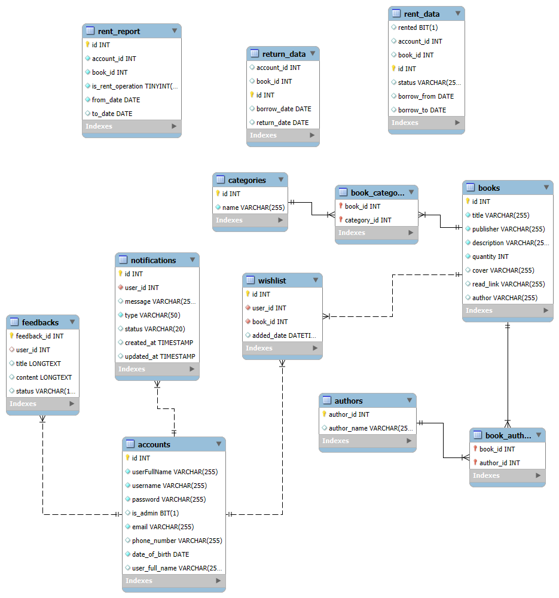
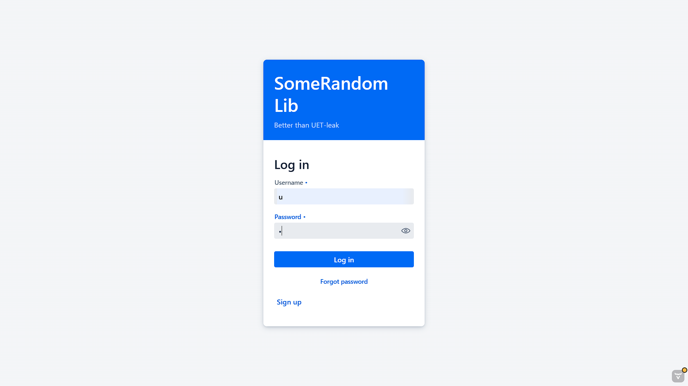
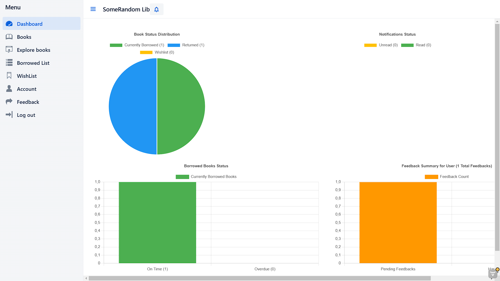
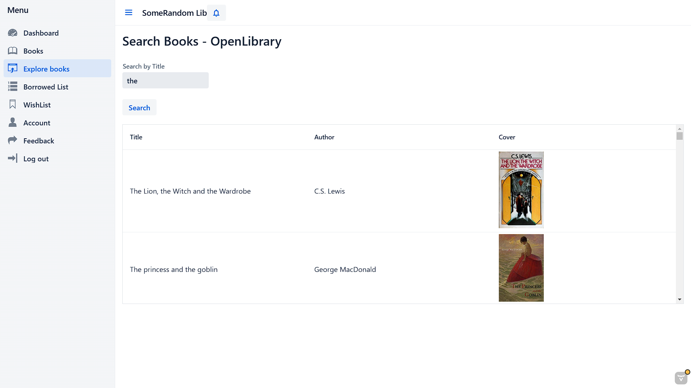
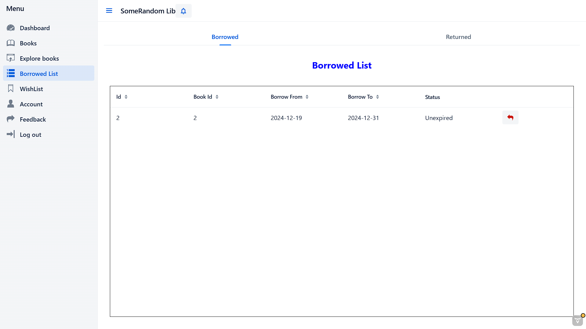

# Some Random Library📚

## Setup 🛠

### Prerequisites

- IntelliJ IDEA
- JDK22
- MySQL
- Vaadin

### Step by step

- Clone and open this repository in IntelliJ IDEA
- Config class `DatabaseHelper.java` to your local settings
- Change  application.yml to your local settings
- Config the project SDK to JDK23 (File -> Project Structure -> Project Settings -> Project)
- Open Maven tool window and run `clean` and `install`
- Open `Run/Debug Configuration` window
- Click New Application and choose JDK23
- Edit configuration with Main Class is Entry Point
- Save and run AppStart to start using our application

## Preview 👓
## Database Structure

## Login Scene

## Dash Board

## Explore Book Using API

## Borrow List

## 💗 Special thanks to 💖
* [minhtruong1411](https://github.com/minhtruong1411)
* [SonLeUET](https://github.com/SonLeUET)

---
<h1 align="center"> 😴 Made by Some Random team ! 🛌</h1>

<i>Dec 2024</i>

